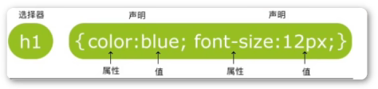
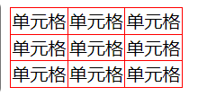
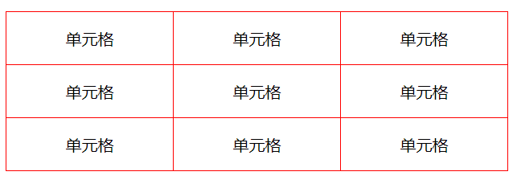
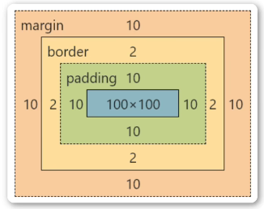
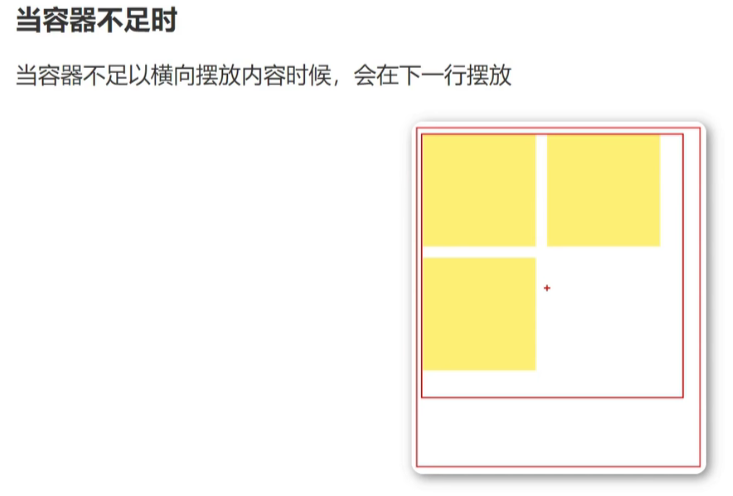
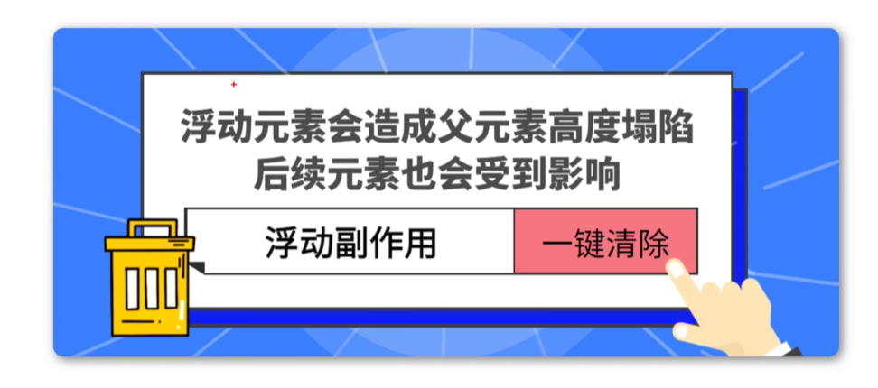
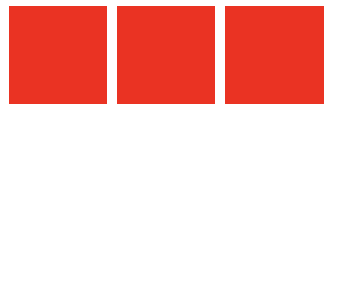

层叠样式表，又叫级联样式表


# 1 语法
选择器+声明


# 2 引入方式
## 1 内联样式（行内样式）

相关标签内使用（style）属性

## 2 内部样式表

当单个文档需要特殊样式时，应该使用内部样式表，可以使用 `<style>` 标签在文档的头部（`<head>`）定义内部样式表

## 3 外部样式

当样式需要应用于很多个网页的时候，外部样式表将是理想的选择。使用 `<link>` 标签进行链接到样式表，`<link>` 标签位于文档的头部。


# 3 选择器

## 1 全局选择器

优先级：**最低**
作用：用于样式初始化
代码：
```css
*{
	margin: 0;
	padding: 0;
}
```

## 2 元素选择器

`<p>` 
`<h>`
``
等标签
代码：
```css
 span{
	 color: red;
 }
```

## 3 类选择器

规定使用圆点 `.` 来定义，选择标签中 `class` 的属性值 
**特点**：
1. 类选择器可以被多种标签使用
2. 类名不能以数字开头
3. 同一个标签可以使用多个类选择器，使用空格分割 ` `


## 4 ID 选择器

规定使用圆点 `#` 来定义，选择标签中 `id` 的属性值 
**特点**：
1. id 是唯一的
2. 只能使用一次 
3. id 不能以数字开头

## 5 合并选择器

语法：`选择器1, 选择器2 {}`
作用：提取共同样式，减少重复代码
代码：
```css
.header, .footer{
	height: 300px;
}
```


# 4 优先级

行内样式 > ID 选择器 > 类选择器 > 元素选择器
==最后写的会覆盖之前写的==


# 5 字体属性

规定文本颜色
```css
div{ color:red; }
div{ color:#ff0000; }
div{ color:rgb(255, 0 ,0) }
div{ color:rgba(255, 0, 0, .5) }
```

## 1 font-size

字体大小
chrome 接受最小的字体大小为 12 px

## 2 font-weight

设置文本粗细
- bold：粗体
- bolder：更粗
- lighter：更细
- 100-900：定义由细到粗 400 等同于默认粗细，700 等同于 bold

## 3 font-style

设置字体样式
- normal：正常显示
- italic：斜体显示

## 4 font-family

设置字体
每个值用逗号分开，==字体名包含空格，必须加上引号==
代码：
```css
font-family:"YaHei", "simsun";
```


# 6 背景属性

`background-color` 设置背景颜色


`background-image` 设置背景图片
可以使用 `url()` 来显示 url 的图片


`background-position` 设置背景图片显示位置

|       值       | 说明                                                             |
| :-----------: | :------------------------------------------------------------- |
|   left top    | 左上角                                                            |
|  left center  | 左中间                                                            |
|  left bottom  | 左下角                                                            |
|   right top   | 右上角                                                            |
| right center  | 右中间                                                            |
| right bottom  | 右下角                                                            |
|  center top   | 中 上                                                            |
| center center | 中 中                                                            |
| center bottom | 中 下                                                            |
|     x% y%     | 第一个值是水平位置，第二个值是垂直位置，左上角是 0 0 ，右下角是 100 100，如果只指定一个值，其他值默认是 50% |
|   xpos ypos   | 单位是像素                                                          |


`background-repeat` 设置背景图片如何填充
- `repeat`：默认值
- `repeat-x`：只向水平方向平铺
- `repeat-y`：只向垂直方向平铺
- `no-repeat`：不平铺


`background-size` 设置背景图片大小属性
-  `length`
设置背景图片的宽度和高度，第一个值宽度，第二个值高度，如果只是设置一个，第二个值 auto
-  `percentage`
计算相对位置区域的百分比，第一个值宽度，第二个值高度，如果只是设置一个，第二个值 auto
-  `cover`
保特图片纵横比开将图片缩放成完全覆盂背景☒域的最小大小,
竭尽全力放到区域最大
-  `contain`
保持图片纵横比并将图像缩放成适合背景定位区域的最大大小


# 7 文本属性

`text-align` 文本的居中|居右|居左

`text-decoration` 规定文本的修饰（下划线 `underline`、上划线 `overline`、删除线 `line-throungh` 等等）

`text-transform` 规定单词大小写
- `captialize` 定义每个单词开头大写
- `uppercase` 定义全部大写字母
- `lowercase` 定义全部小写字母

`text-indent` 规定文本块中首行文本的缩进
- 负值是允许的，


# 8 表格属性

## 1 表格边框

`border`
代码：
```css
table {
	border: 1px solid red;
}
```

## 2 折叠边框

`border-collapse` 设置表格的边框是否被折叠成单个的边框或者隔开
代码：
```css
table {
	border-collapse: collapse;   // 折叠边框
}
table,td {
	border: 1px solid red;
}
```



## 3 表格宽度和高度

`width` 和 `height` 定义宽度和高度


## 4 表格文字对齐

通过设置 `td` 中的 `text-align` 来设置水平对齐
通过设置 `vertical-align` 来设置垂直对齐属性

代码：
```css
td {
	height: 50px;
	text-align: center;
	vertical-align: auto;
}
```


## 5 表格填充

`padding` 为文本和 `border` 之间的距离
可以通过 `padding` 撑开表格，不用特意设置表格的大小


# 9 关系选择器

## 1 后代选择器

选择所有被 E 元素包含的 F 元素，中间用空格隔开
代码：
```css
ul li {
	color: red;
}
```
只要 li 是 ul 的后代，则都会被选中


## 2 子代选择器

选择所有作为 E 元素的直接子元素 F，对下一层不起作用
语法：
```css
E>F {}
```


## 3 相邻兄弟选择器

选择相邻的下一个兄弟元素
语法：
```css
h1+p {}
```

## 4 通用兄弟选择器

选择 E 元素后的所有兄弟元素 F
语法：
```css
E~F {}
```


# 10 盒子模型




# 11 弹性盒模型

`flex box`

CSS 3 的新布局

通过设置 `display` 属性值为 `flex`
针对的是多个子元素而言
代码：
```html
<div class="flex-container">
	<div class="flex-item">flex item</div>
</div>
<style>
	.flex-container {
		display: flex;
	}
</style>
```
默认弹性盒的内容横向摆放

## 1 子盒子方向

1.  `flex-direction`

开启弹性盒模型后，可以使用 `flex-direction` 指定子元素在父容器中的位置
语法：
```css
flex-direction: row | row-reverse | column | column-reverse
```
- `row`：横向（默认）
- `row-reverse`：反向横向排列（翻转后会靠右对齐）
- `column`：纵向
- `column-reverse`：反向纵向排列（翻转后会靠下对齐）


2. `justify-content`

内容对齐属性应用在弹性容器上，把弹性项沿着弹性容器的主轴线（main axis）（垂直方向）对齐
语法：
```css
justify-content: flex-start | flex-end | center
```
- `flex-start`：弹性项向行头紧挨着填充（默认）
- ` flex-end`：弹性项向行尾紧挨着填充，第一个弹性项的 main-end 外边距线被放置在该行的 main-end 边线，而后续弹性项以此平齐摆放
- `center`：弹性项居中紧挨着填充（如果剩余的空间为负，则弹性项在两个方向上同时溢出）


3. `align-items`

对应上面的 `justify-content` 而言，`align-items`  是控制水平方向对齐的属性

**注意**：
上面的属性都是应用在弹性容器上，效果为对弹性容器内的弹性项生效。

要设置一个盒子居中：
```css
display: flex;
justify-content: center;
align-items: center;
```
上面的三局代码即可实现


## 2 子盒子属性

`flex-grow` / `flex`

根据弹性盒子元素设置的扩展因子作为比率来分配剩余空间，默认为 0
如果只有一个子元素设置，那么按扩展因子转化的百分比对其分配剩余空间


# 12 文档流

文档流式文档中可显示对象在排列时所占用的位置/空间
标准流限制非常多，导致很多页面效果无法实现
- 高矮不齐
- 空格折叠
- 照片空隙

## 1 脱离文档流

使一个元素脱离标准文档流：
1. 浮动
2. 绝对定位
3. 固定定位

## 2 浮动

增加一个浮层来放置内容

定义：`float` 属性定义元素在哪个方向浮动，任何元素都可以浮动

|  值   | 描述         |
|:-----:| ------------ |
| left  | 元素向左浮动 |
| right | 元素向右浮动 |
浮动原理：
1. 浮动后，元素脱离文档流
2. 浮动只有左右浮动，没有上下浮动 


要考虑宽度

## 3 清除浮动



浮动副作用
当元素设置 float 后，该元素会脱离文档流并向左/右浮动
- 浮动元素会造成 父元素高度坍塌
- 后续文件会受到影响


### 3.1 后续文件的影响

代码：
```css
.container {
	width: 500px;
	background-color: #888;
}

.box {
	width: 100px;
	height: 100px;
	background-color: red;
	margin: 5px;
}
```
效果为：

代码：
```css
.container {
	width: 500px;
	background-color: #888;
}

.box {
	width: 100px;
	height: 100px;
	background-color: red;
	margin: 5px;
	float: left;
}
```
效果为：

因为 `container` 是根据内容撑开的，当内容 `float` 浮动了那么，父级容器就无法撑开了，造成消失的效果


### 3.2 清除浮动方法

1. 父元素设置高度
2. 受影响的元素增加 clear 属性
3. overflow 清除浮动
4. 伪对象方式

- 父元素设置高度，会抑制父元素坍塌，**但是不会消除浮动子元素之后的子元素的影响**
- 受影响的元素应该添加 clear 属性值（`clear: both;`）
- overflow


# 13 应用


## 1 `display: none;` 和 `visibility: hidden;` 的区别


`display: none;` 和 `visibility: hidden;` 是 CSS 中用于隐藏元素的两种常见方法，它们之间有一些区别：

1. **`display: none;`**：
   - 元素及其所占据的空间都会被隐藏，即使在文档流中也**不会占据位置**。
   - 元素被隐藏后，**不会响应用户的任何事件**，如点击、鼠标悬停等。
   - 对于被隐藏的元素，其子元素也会被隐藏。
   - 当需要完全隐藏元素时，通常使用 `display: none;`。

2. **`visibility: hidden;`**：
   - 元素本身被隐藏，但是其所占据的空间仍然保留，即元素**仍然占据文档流中的位置**。
   - 元素被隐藏后，**仍然会响应用户的事件**，如点击、鼠标悬停等。
   - 对于被隐藏的元素，其子元素也会被隐藏。
   - 当需要隐藏元素但保留其所占据的空间时，通常使用 `visibility: hidden;`。

用法示例：

```css
/* 使用 display: none; 来隐藏元素 */
.hidden-element {
    display: none;
}

/* 使用 visibility: hidden; 来隐藏元素 */
.hidden-element {
    visibility: hidden;
}
```

在实际应用中，根据具体需求选择合适的隐藏方式。如果需要完全移除元素并且不占据空间，使用 `display: none;`；如果需要保留元素所占据的空间，同时隐藏元素内容，使用 `visibility: hidden;`。


