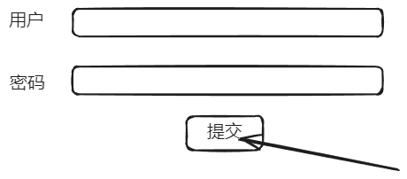
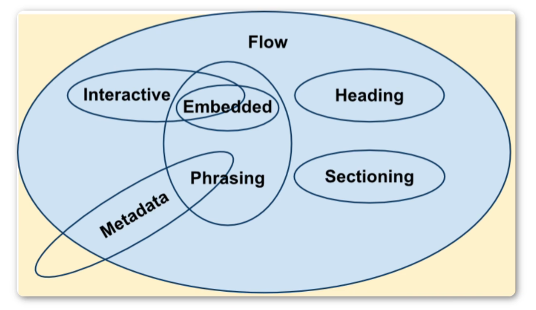
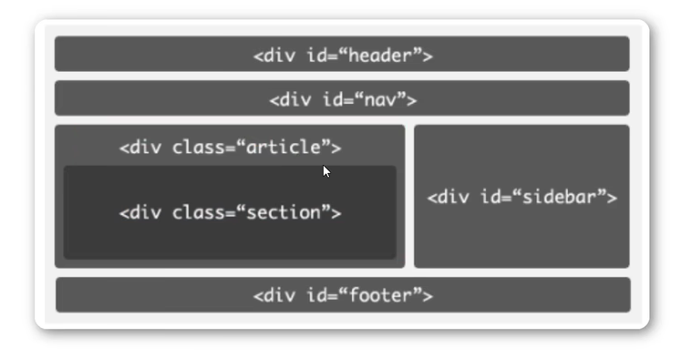
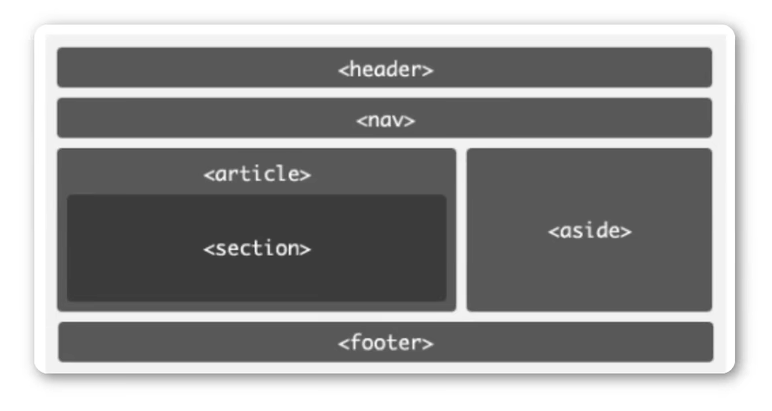

HTML 是超文本标记语言
- 双标签、单标签
- DOCTYPE 声明，避免浏览器的怪异模式（不同浏览器不同效果）


# 1 头部
`<head>` 
- 包含信息
- `<title>` 有利于 SEO（**搜索引擎优化**）
- `<mata>` 描述网页的属性，信息，`charset="utf-8"`

`<body>` 主体内容
- `<h>` 标签之应用于标题，不能用于对文本的加粗强调（文本的修饰使用 CSS 来完成）
- `<br>` 用于 `<p>` 内的换行（单标签）
- `<hr>` 水平线标签
	- 属性：`color="" width="" size="" align=""`
	- `align` 属性用于规定水平线的位置
- ``
	- 属性：`src` 路径 url、`alt` 用于替代的文字、`title` 鼠标悬浮在图片上给予的提示
- `<a>`
	- 属性：`href` 跳转的 url


# 2 文本标签
-  `<em>`：着重文字
-  `<b>`：粗体
-  `<i>`：斜体
-  `<strong>`：加强语气
-  `<del>`：删除线
-  `<span>`：没有特殊定义的容器

# 3 列表
1. 有序列表
	- `<ol>`
	- `<li>`
1. 无序列表
	- `<ul>`：属性中 `type` 有四种值 `disc`（实心圆）、`circle`（空心圆）、`square`（小方块）、`none`（不显示）
	- `<li>`
导航栏一般用无序列表来实现

# 4 表格
`<table>`：
- `<tr>` 表示一行
- `<td>` 表示一行内的一个元素
表格合并：
- 水平合并：colspan（保留左边）
- 垂直合并：rowspan（保留上边）

# 5 表单
`<form>`：一般由 `容器` 和 `控件` 组成
- 属性：
	- `action` 指向 url
	- `name` 容器名
	- `method` 指定表单使用的方法（GET|POST）
- `<input>` 属性：
	- `value` 显示控件的显示值（当 `type` 为 submit 的时候）

其中，提交为 `value`

# 6 块内元素与行内元素

HTML 5 之前
- 块内元素
- 内联元素

HTML 5 之后
- 元数据（metadata content）
- 区块型（sectioning content）
- 标题型（heading content）
- 文档流型（flow content）
- 语句型（phrasing content）
- 内嵌型（embedded content）
- 交互型（interactive content）

详细地址 https://developer.mozilla.org/zh-CN/docs/Web/Guide/HTML/Content_categories

## 1 内联元素和块级元素的区别

|         块级元素          |          内联元素          |
| :-------------------: | :--------------------: |
|     块元素会在页面中独占一行      | 行内元素不会独占页面中的一行，只占自身的大小 |
|  可以设置width，height属性   | 行内元素设置width，height属性无效 |
| 一半块级元素可以包含行内元素和其他块级元素 |  一半内联元素包含内联元素不包含块级元素   |
常见的块级元素
> div、form、h、hr、p、table、ul 等等

常见内联元素（不能识别宽高）
> a、b、em、i、span、strong 等

行内块元素（不能换行、能够识别宽高）
> button、img、input 等


# 7 HTML 5 新增标签
2014 年 `w3c` 制定的

`div` 容器元素




`<header>` 头部
`<nav>` 导航
`<section>` 定义文档中的节，比如章节、页眉、页脚
`<aside>` 侧边栏
`<footer>` 脚部
`<article>` 代表一个独立的、完整的相关内容块，例如一篇完整的论坛帖子，一篇博客文章，一个用户评论


# 8 相对路径
- 子级关系："/"
- 父级关系："../"
- 同级关系："./"


# 9 常用知识


## 1 HTML 元素显示为文本

### 1.1 使用 HTML 实体
将 `<` 和 `>` 替换为 HTML 实体 `&lt;` 和 `&gt;`，这样浏览器就会将它们当作文本来处理：

```html
&lt;div class="g-progress" style="--progress: 50%"&gt;&lt;/div&gt;
```

### 1.2 使用 `pre` 标签
如果你不想转换为实体，可以将代码包裹在 `pre` 标签中，并使用 `&lt;` 和 `&gt;` 实体：

```html
<pre>&lt;div class="g-progress" style="--progress: 50%"&gt;&lt;/div&gt;</pre>
```

### 1.3 使用 `code` 标签
你也可以用 `code` 标签来显示代码片段，但仍需将 `<` 和 `>` 转换为实体：

```html
<code>&lt;div class="g-progress" style="--progress: 50%"&gt;&lt;/div&gt;</code>
```

### 1.4 使用 JavaScript 转义
如果你在动态内容中插入代码，可以使用 JavaScript 转义：

```javascript
const code = '<div class="g-progress" style="--progress: 50%"></div>';
document.write(code.replace(/</g, '&lt;').replace(/>/g, '&gt;'));
```

这样，浏览器就会直接显示 `<div class="g-progress" style="--progress: 50%"></div>` 作为文本内容。


