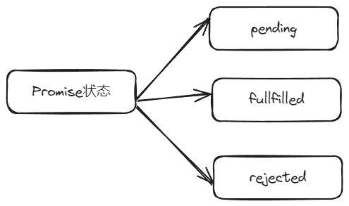

# 1 变量

JavaScript 中**变量提升**，指的是使用变量稍后再声明变量而不会引发异常


ECMAScript 标准定义了 8 种数据类型：

- 七种基本数据类型：
    - 布尔值（Boolean），有 2 个值分别是：`true` 和 `false`。
    - null，一个表明 null 值的特殊关键字。JavaScript 是大小写敏感的，因此 `null` 与 `Null`、`NULL`或变体完全不同。
    - undefined，和 null 一样是一个特殊的关键字，undefined 表示变量未赋值时的属性。
    - 数字（Number），整数或浮点数，例如： `42` 或者 `3.14159`。
    - 任意精度的整数（BigInt），可以安全地存储和操作大整数，甚至可以超过数字的安全整数限制。
    - 字符串（String），字符串是一串表示文本值的字符序列，例如：`"Howdy"`。
    - 代表（Symbol，在 ECMAScript 6 中新添加的类型）。一种实例是唯一且不可改变的数据类型。
- 以及对象（Object）。


# 2 常量

使用 `const` 作为定义常量
```js
const PI = 3.14;
```

在同一作用域中，不能使用与变量名或函数名相同的名字来命名常量。例如：

```js
// 这会造成错误
function f() {}
const f = 5;

// 这也会造成错误
function f() {
  const g = 5;
  var g;

  //语句
}
```


对象属性被赋值为常量是不受保护的，所以下面的语句执行时不会产生错误。

```js
const MY_OBJECT = { key: "value" };
MY_OBJECT.key = "otherValue";
```


# 3 字符串

字符串转化为数字
- `parseInt()` 
- `parseFloat()`


# 4 字面值

## 4.1 数组字面值

数组字面值是一个封闭在方括号对 ([]) 中的包含有零个或多个表达式的列表，其中每个表达式代表数组的一个元素。
```js
var coffees = ["French Roast", "Colombian", "Kona"];

var a = [3];

console.log(a.length); // 1

console.log(a[0]); // 3
```
### 4.1.1 数组字面值中的多余逗号

你不必列举数组字面值中的所有元素。若你在同一行中连写两个逗号（,），数组中就会产生一个没有被指定的元素，其初始值是 `undefined`。以下示例创建了一个名为 `fish` 的数组：

```js
var fish = ["Lion", , "Angel"];
```


## 4.2 布尔字面值


## 4.3 数字字面值


## 4.4 整数字面值
整数可以用十进制（基数为 10）、十六进制（基数为 16）、八进制（基数为 8）以及二进制（基数为 2）表示。

- 十进制整数字面量由一串数字序列组成，且没有前缀 0。
- 八进制的整数以 0（或 0O、0o）开头，只能包括数字 0-7。
- 十六进制整数以 0x（或 0X）开头，可以包含数字（0-9）和字母 a~f 或 A~F。
- 二进制整数以 0b（或 0B）开头，只能包含数字 0 和 1。

严格模式下，八进制整数字面量必须以 0o 或 0O 开头，而不能以 0 开头。

整数字面量举例：

```
0, 117 and -345 (十进制，基数为 10)
015, 0001 and -0o77 (八进制，基数为 8)
0x1123, 0x00111 and -0xF1A7 (十六进制，基数为 16 或"hex")
0b11, 0b0011 and -0b11 (二进制，基数为 2) 
```


## 4.5 浮点数字面值


## 4.6 对象字面值


# 5 闭包

闭包可以包含多个作用域；它们递归地包含了所有包含它的函数作用域。这个称之为_作用域链_。


# 6 预定义函数

JavaScript 语言有几个顶级的内置函数：

- **`eval()`** 方法执行方法计算以字符串表示的 JavaScript 代码。

- **`isFinite()`** 全局函数判断传入的值是否是有限的数值。如果需要的话，其参数首先被转换为一个数值。

- **`isNaN()`** 函数判断一个值是否是 [`NaN`](https://developer.mozilla.org/zh-CN/docs/Web/JavaScript/Reference/Global_Objects/NaN)。注意：`isNaN` 函数内部的强制转换规则十分[有趣](https://developer.mozilla.org/zh-CN/docs/Web/JavaScript/Reference/Global_Objects/isNaN#%E6%8F%8F%E8%BF%B0)。你也可以使用 [`Number.isNaN()`](https://developer.mozilla.org/zh-CN/docs/Web/JavaScript/Reference/Global_Objects/Number/isNaN) 来判断该值是否为 NaN。

- **`parseFloat()`** 函数解析字符串参数，并返回一个浮点数。

- **`parseInt()`** 函数解析字符串参数，并返回指定的基数（基础数学中的数制）的整数。

- **`decodeURI()`** 函数对先前经过 [`encodeURI`](https://developer.mozilla.org/zh-CN/docs/Web/JavaScript/Reference/Global_Objects/encodeURI) 函数或者其他类似方法编码过的统一资源标志符（URI）进行解码。

- **`decodeURIComponent()`** 方法对先前经过 [`encodeURIComponent`](https://developer.mozilla.org/zh-CN/docs/Web/JavaScript/Reference/Global_Objects/encodeURIComponent) 函数或者其他类似方法编码的统一资源标志符（URI）进行解码。

- **`encodeURI()`** 方法通过以表示字符的 UTF-8 编码的一个、两个、三个或四个转义序列替换统一资源标识符（URI）的某些字符来进行编码（对于由两个“代理（surrogate）”字符组成的字符，只会编码为四个转义序列）。

- **`encodeURIComponent()`** 方法通过以表示字符的 UTF-8 编码的一个、两个、三个或四个转义序列替换统一资源标识符（URI）的某些字符来进行编码（对于由两个“代理”字符组成的字符，只会编码为四个转义序列）。


# 7 基本表达式

`this` 会用来指代当前对象。一般 `this` 指代的对象是方法中被使用的对象


# 8 类


## 8.1 私有字段


JavaScript 中的私有字段是**硬私有的**。如果类没有实现暴露这些私有字段的方法，也就没有任何机制可以从类外访问它们。这意味着你可以对类的私有字段做任何重构，只要暴露的方法的行为保持不变即可。


## 8.2 继承与扩展

派生类可以访问父类的所有公共属性。在 JavaScript 中，派生类是通过 [`extends`](https://developer.mozilla.org/zh-CN/docs/Web/JavaScript/Reference/Classes/extends) 子句声明的，它指示它扩展自哪个类。

```JS
class ColorWithAlpha extends Color {
  #alpha;
  constructor(r, g, b, a) {
    super(r, g, b);
    this.#alpha = a;
  }
  get alpha() {
    return this.#alpha;
  }
  set alpha(value) {
    if (value < 0 || value > 1) {
      throw new RangeError("Alpha 值必须在 0 与 1 之间");
    }
    this.#alpha = value;
  }
}
```

有一些事情需要注意。首先，在构造器中，我们调用了 `super(r, g, b)`。在访问 `this` 之前，必须调用 [`super()`](https://developer.mozilla.org/zh-CN/docs/Web/JavaScript/Reference/Operators/super)，这是 JavaScript 的要求。`super()` 调用父类的构造函数来初始化 `this`——这里大致相当于 `this = new Color(r, g, b)`。`super()` 之前也可以有代码，但你不能在 `super()` 之前访问 `this`——JavaScript 会阻止你访问未初始化的 `this`。

在父类完成对 `this` 的修改后，派生类才可以对其进行自己的逻辑。这里我们添加了一个名为 `#alpha` 的私有字段，并提供了一对 getter/setter 来与之交互。

派生类会继承父类的所有方法。例如，尽管 `ColorWithAlpha` 自身并没有声明一个 `get red()` getter，你仍然可以访问 `red`，因为这个行为是由父类指定的：

```js
const color = new ColorWithAlpha(255, 0, 0, 0.5);
console.log(color.red); // 255
```

派生类也可以覆盖父类的方法。例如，所有类都隐式继承自 [`Object`](https://developer.mozilla.org/zh-CN/docs/Web/JavaScript/Reference/Global_Objects/Object) 类，它定义了一些基本方法，例如 [`toString()`](https://developer.mozilla.org/zh-CN/docs/Web/JavaScript/Reference/Global_Objects/Object/toString)。然而，基本的 `toString()` 方法是出了名的无用方法，因为它在大多数情况下打印 `[object Object]`：

```js
console.log(red.toString()); // [object Object]
```

所以，我们可以覆盖它，以便在打印颜色时打印它的 RGB 值：

```js
class Color {
  #values;
  // …
  toString() {
    return this.#values.join(", ");
  }
}

console.log(new Color(255, 0, 0).toString()); // '255, 0, 0'
```

在派生类内，你可以使用 `super` 访问父类的方法。这允许你可以在避免代码重复的情况下增强父类的方法。

```js
class ColorWithAlpha extends Color {
  #alpha;
  // …
  toString() {
    // 调用父类的 toString()，并以此构建新的返回值
    return `${super.toString()}, ${this.#alpha}`;
  }
}

console.log(new ColorWithAlpha(255, 0, 0, 0.5).toString()); // '255, 0, 0, 0.5'
```

当你用 `extends` 时，静态方法也会继承，因此你也可以覆盖或增强它们。

```js
class ColorWithAlpha extends Color {
  // ...
  static isValid(r, g, b, a) {
    // 调用父类的 isValid()，并在此基础上增强返回值
    return super.isValid(r, g, b) && a >= 0 && a <= 1;
  }
}

console.log(ColorWithAlpha.isValid(255, 0, 0, -1)); // false
```

派生类无权访问父类的私有字段——这是 JavaScript 私有字段的一个关键特性（“硬私有”）。私有字段的有效范围被严格限制在类体内，所以_任何_外部代码都无权访问。

```js
class ColorWithAlpha extends Color {
  log() {
    console.log(this.#values); // SyntaxError: Private field '#values' must be declared in an enclosing class
  }
}
```

一个类只能至多扩展自一个父类。这可以防止多重继承中的问题，例如[菱形问题](https://en.wikipedia.org/wiki/Multiple_inheritance#The_diamond_problem)。然而，由于 JavaScript 的动态性，仍然可以通过类组合和 [mixin](https://developer.mozilla.org/zh-CN/docs/Web/JavaScript/Reference/Classes/extends#mix-ins) 来实现多重继承的效果。

派生类的实例同时也是父类的实例，可用 [`instancesof`](https://developer.mozilla.org/zh-CN/docs/Web/JavaScript/Reference/Operators/instanceof) 运算符来验证。

```js
const color = new ColorWithAlpha(255, 0, 0, 0.5);
console.log(color instanceof Color); // true
console.log(color instanceof ColorWithAlpha); // true
```


## 8.3 为什么要使用类

因为类引入了一种范式，类是面向对象的一种编程方式。面向对象编程是建立在继承和多态上的。


# 9 Promise


## 9.1 什么是 Promise 

`Promise` 是一个代表异步操作最终结果的对象。
本之上 Promise 是一个函数返回的对象，可以绑定回调函数

假设现在有一个名为 `createAudioFileAsync()` 的函数，它接收一些配置和两个回调函数，然后异步地生成音频文件。一个回调函数在文件成功创建时被调用，另一个则在出现异常时被调用。

以下为使用 `createAudioFileAsync()` 的示例：

```js
// 成功的回调函数
function successCallback(result) {
  console.log("音频文件创建成功：" + result);
}

// 失败的回调函数
function failureCallback(error) {
  console.log("音频文件创建失败：" + error);
}

createAudioFileAsync(audioSettings, successCallback, failureCallback);
```

如果重写 `createAudioFileAsync()` 为返回 Promise 的形式，你可以把回调函数附加到它上面：

```js
createAudioFileAsync(audioSettings).then(successCallback, failureCallback);
```


## 9.2 Promise 的优势

- 链式回调

连续执行两个或者多个异步操作是一个常见的需求，在上一个操作执行成功之后，开始下一个的操作，并带着上一步操作所返回的结果。在旧的回调风格中，这种操作会导致经典的回调地狱：
```js
doSomething(function (result) {
  doSomethingElse(result, function (newResult) {
    doThirdThing(newResult, function (finalResult) {
      console.log(`得到最终结果：${finalResult}`);
    }, failureCallback);
  }, failureCallback);
}, failureCallback);
```
有了 Promise，我们就可以通过一个 Promise 链来解决这个问题。这就是 Promise API 的优势，因为回调函数是附加到返回的 Promise 对象上的，而不是传入一个函数中。

见证奇迹的时刻：`then()` 函数会返回一个和原来不同的**新的 Promise**：
```js
const promise = doSomething();
const promise2 = promise.then(successCallback, failureCallback);
```

`promise2` 不仅表示 `doSomething()` 函数的完成，也代表了你传入的 `successCallback` 或者 `failureCallback` 的完成，这两个函数也可以返回一个 Promise 对象，从而形成另一个异步操作，这样的话，在 `promise2` 上新增的回调函数会排在这个 Promise 对象的后面。

就像这样，每一个 Promise 都代表了链中另一个异步过程的完成。此外，`then` 的参数是可选的，`catch(failureCallback)` 等同于 `then(null, failureCallback)`——所以如果你的错误处理代码对所有步骤都是一样的，你可以把它附加到链的末尾：
```js
doSomething()
  .then(function (result) {
    return doSomethingElse(result);
  })
  .then(function (newResult) {
    return doThirdThing(newResult);
  })
  .then(function (finalResult) {
    console.log(`得到最终结果：${finalResult}`);
  })
  .catch(failureCallback);
```

你或许会看到这种形式的[箭头函数](https://developer.mozilla.org/zh-CN/docs/Web/JavaScript/Reference/Functions/Arrow_functions)：
```js
doSomething()
  .then((result) => doSomethingElse(result))
  .then((newResult) => doThirdThing(newResult))
  .then((finalResult) => {
    console.log(`得到最终结果：${finalResult}`);
  })
  .catch(failureCallback);
```

**注意**：一定要有返回值，否则，回调将无法获取上一个 Promise 的结果。（如果使用箭头函数，`() => x` 比 `() => { return x; }` 更简洁一些，但后一种保留 `return` 的写法才支持使用多个语句）。如果上一个处理程序启动了一个 Promise 但并没有返回它，那就没有办法再追踪它的状态了，这个 Promise 就是“漂浮”的。
```js
doSomething()
  .then((url) => {
    // 忘记返回了！
    fetch(url);
  })
  .then((result) => {
    // 结果是 undefined，因为上一个处理程序没有返回任何东西。
    // 无法得知 fetch() 的返回值，不知道它是否成功。
  });
```

如果有竞争条件的话，情况会更糟——如果上一个处理程序的 Promise 没有返回，那么下一个 `then` 处理程序会提前调用，而它读取的任何值都可能是不完整的。
```js
const listOfIngredients = [];

doSomething()
  .then((url) => {
    // 忘记返回了！
    fetch(url)
      .then((res) => res.json())
      .then((data) => {
        listOfIngredients.push(data);
      });
  })
  .then(() => {
    console.log(listOfIngredients);
    // 永远是 []，因为 fetch 请求还没有完成。
  });
```

因此，一个经验法则是，每当你的操作遇到一个 Promise，就返回它，并把它的处理推迟到下一个 `then` 处理程序中。
```js
const listOfIngredients = [];

doSomething()
  .then((url) =>
    fetch(url)
      .then((res) => res.json())
      .then((data) => {
        listOfIngredients.push(data);
      }),
  )
  .then(() => {
    console.log(listOfIngredients);
  });

// 或

doSomething()
  .then((url) => fetch(url))
  .then((res) => res.json())
  .then((data) => {
    listOfIngredients.push(data);
  })
  .then(() => {
    console.log(listOfIngredients);
  });
```


Promise 内部有三种状态




# 10 JavaScript DOM

JavaScript 中的 DOM (Document Object Model, 文档对象模型) 是一个编程接口, 用于与网页中的元素进行交互和操作。通过 DOM, JavaScript 可以访问和修改网页的内容、结构和样式。

DOM 将网页表示为一个树形结构, 每个节点表示网页中的一个部分, 例如元素、文本或注释。最顶层的节点是 `document` 对象, 它表示整个文档, 也是访问 DOM 树的入口点。


好的, 我们继续更详细地介绍 DOM 及其使用方式:

## 10.1 DOM 树结构

DOM 将整个文档表示为一个树形结构, 每个节点代表文档的一部分。主要节点类型包括:

1. **文档节点**(`document`)
2. **元素节点**(`element`)
3. **文本节点**(`text`)
4. **属性节点**(`attr`)

每个节点都可以通过树形结构进行访问和操作, 例如:

- `parentNode` 属性可以访问父节点
- `childNodes` 属性可以访问子节点列表
- `firstChild` 和 `lastChild` 属性可以访问第一个和最后一个子节点
- `nextSibling` 和 `previousSibling` 属性可以访问相邻的节点

```javascript
const body = document.body;
const children = body.childNodes; // 获取 body 的所有子节点
const firstChild = body.firstChild; // 获取 body 的第一个子节点
```

**节点操作**

除了获取节点, 我们还可以创建、插入、替换和删除节点:

1. **创建节点**

- `document.createElement(tagName)` 创建一个元素节点
- `document.createTextNode(text)` 创建一个文本节点

2. **插入节点**

- `parentNode.appendChild(newNode)` 将新节点追加到父节点的子节点列表末尾
- `parentNode.insertBefore(newNode, refNode)` 在指定的子节点前插入新节点

3. **替换节点**

- `parentNode.replaceChild(newNode, oldNode)` 用新节点替换一个子节点

4. **删除节点**

- `parentNode.removeChild(node)` 从父节点中移除一个子节点

```javascript
// 创建一个新的 div 元素
const newDiv = document.createElement('div');

// 创建一个文本节点
const textNode = document.createTextNode('Hello, World!');

// 将文本节点添加到 div 中
newDiv.appendChild(textNode);

// 将新 div 插入到 body 的开头
document.body.insertBefore(newDiv, document.body.firstChild);
```

**元素属性和样式**

我们可以通过 DOM 来访问和修改元素的属性和样式:

1. **属性**

- `element.getAttribute(name)` 获取指定属性的值
- `element.setAttribute(name, value)` 设置指定属性的值
- `element.removeAttribute(name)` 移除指定属性

2. **样式**

- `element.style.property` 访问元素的内联样式属性

```javascript
// 获取 id 属性
const idValue = element.getAttribute('id'); 

// 设置 class 属性
element.setAttribute('class', 'my-class');

// 修改背景色
element.style.backgroundColor = 'red';
```

**事件**

DOM 事件允许我们捕获用户交互或浏览器事件, 并执行相应的操作:

1. **事件监听器**

- `element.addEventListener(event, callback)` 添加事件监听器
- `element.removeEventListener(event, callback)` 移除事件监听器

2. **事件对象**

   在事件回调函数中, 可以访问 `event` 对象, 其中包含了事件相关的信息和功能, 如事件类型、目标元素、键盘按键等。

3. **事件传播**

   事件会沿着 DOM 树进行传播,首先是捕获阶段 (从窗口到目标元素), 然后是冒泡阶段 (从目标元素到窗口)。我们可以通过 `event.stopPropagation()` 来阻止事件进一步传播。

```javascript
const button = document.getElementById('myButton');

// 添加点击事件监听器
button.addEventListener('click', function(event) {
  console.log('Button clicked!');
  
  // 阻止默认行为(如果有)
  event.preventDefault(); 
  
  // 停止事件传播
  event.stopPropagation();
});
```

总之, DOM 提供了非常丰富和强大的功能, 让我们可以通过 JavaScript 来完全控制网页的内容、结构和行为。无论是操作节点、修改样式还是处理事件, 都需要深入学习和掌握 DOM 相关的 API 和概念。掌握了 DOM, 我们就能够创建出更加动态和交互性强的 Web 应用程序。


## 10.2 常见的 DOM 操作

1. **获取元素**

可以使用以下方法获取页面中的元素:

- `getElementById(id)`: 通过元素的 id 获取单个元素
- `getElementsByClassName(className)`: 通过类名获取一组元素
- `getElementsByTagName(tagName)`: 通过标签名获取一组元素
- `querySelector(selector)`: 通过 CSS 选择器获取第一个匹配的元素
- `querySelectorAll(selector)`: 通过 CSS 选择器获取所有匹配的元素

示例:

```javascript
const element1 = document.getElementById('myElement');
const elements2 = document.getElementsByClassName('myClass');
const elements3 = document.querySelectorAll('div.myClass');
```

2. **修改元素**

获取到元素后, 可以修改它们的属性、样式和内容:

- `element.innerHTML`: 设置元素的 HTML 内容
- `element.textContent`: 设置元素的文本内容
- `element.style.property`: 设置元素的 CSS 样式
- `element.setAttribute(name, value)`: 设置元素的属性值

示例:

```javascript
const element = document.getElementById('myElement');
element.innerHTML = '<p>New Content</p>';
element.style.color = 'red';
element.setAttribute('data-id', '123');
```

3. **创建和删除元素**

- `document.createElement(tagName)`: 创建新的 HTML 元素
- `parent.appendChild(child)`: 将子元素添加到父元素
- `parent.removeChild(child)`: 从父元素移除子元素

示例:

```javascript
const newElement = document.createElement('div');
newElement.textContent = 'New Element';
document.body.appendChild(newElement);
```

4. **事件处理**

DOM 还提供了事件机制, 允许我们监听和响应各种事件, 例如用户交互、网络事件等。

- `element.addEventListener(event, callback)`: 添加事件监听器
- `element.removeEventListener(event, callback)`: 移除事件监听器

示例:

```javascript
const button = document.getElementById('myButton');
button.addEventListener('click', function() {
  console.log('Button clicked!');
});
```

总之, DOM 提供了一种标准化的方式来操作和交互网页中的元素, 是 JavaScript 与网页进行交互的关键接口。通过学习和掌握 DOM, 我们可以创建动态和交互式的网页应用。

## 10.3 例子

好的, 我们可以使用 JavaScript 和 DOM 操作来实现一个简单的登录、验证和注销功能。下面是一个示例:

HTML 结构:

```html
<div>
  <h2>用户登录</h2>
  <form id="login-form">
    <label for="username">用户名:</label>
    <input type="text" id="username" required>
    <br>
    <label for="password">密码:</label>
    <input type="password" id="password" required>
    <br>
    <button type="submit">登录</button>
  </form>
  <div id="user-info" style="display: none;">
    <p>欢迎 <span id="username-display"></span></p>
    <button id="logout-btn">注销</button>
  </div>
</div>
```

JavaScript 代码:

```javascript
const loginForm = document.getElementById('login-form');
const userInfo = document.getElementById('user-info');
const usernameDisplay = document.getElementById('username-display');
const logoutBtn = document.getElementById('logout-btn');

// 模拟用户数据
const users = [
  { username: 'admin', password: 'password' }
];

loginForm.addEventListener('submit', function(event) {
  event.preventDefault(); // 阻止表单默认提交行为

  const username = document.getElementById('username').value;
  const password = document.getElementById('password').value;

  // 验证用户名和密码
  const user = users.find(u => u.username === username && u.password === password);

  if (user) {
    // 登录成功
    loginForm.style.display = 'none';
    userInfo.style.display = 'block';
    usernameDisplay.textContent = user.username;
  } else {
    // 登录失败
    alert('用户名或密码错误');
  }
});

logoutBtn.addEventListener('click', function() {
  // 注销
  loginForm.style.display = 'block';
  userInfo.style.display = 'none';
  document.getElementById('username').value = '';
  document.getElementById('password').value = '';
});
```

在这个示例中, 我们首先创建了一个包含用户名和密码输入框的登录表单。然后, 我们监听表单的提交事件, 获取用户输入的用户名和密码, 并与模拟的用户数据进行比对。如果用户名和密码正确, 我们就隐藏登录表单, 显示包含用户名和注销按钮的用户信息区域。

注销按钮的点击事件会重新显示登录表单, 隐藏用户信息区域, 并清空用户名和密码输入框的值。

这只是一个最基本的示例, 在实际应用中, 你可能需要进行更多的验证和处理, 例如防止跨站请求伪造、使用 HTTPS 传输密码、添加注册功能等。但是, 它展示了如何使用 JavaScript 和 DOM 操作来实现基本的登录、验证和注销功能。


# 11 `.js`、`.mjs` 和 `.cjs` 的区别


## 11.1 .js

**传统的 JavaScript 文件**

`.js` 是 JavaScript 的默认文件后缀，也是最常用的文件类型。它通常用于在 Web 页面中嵌入 JavaScript 代码，或者通过 `<script>` 标签在 HTML 文件中引入 JavaScript 文件。由于 `.js` 文件是纯文本文件，因此可以直接编辑和阅读。


## 11.2 .mjs

**ES Modules 文件**

`.mjs` 是 ECMAScript 模块（ES Modules）的文件后缀。ES Modules 是 JavaScript 的模块化标准，它允许开发者将代码拆分为多个独立的模块，并通过 import 和 export 语句进行模块间的交互。`.mjs` 文件通常用于现代前端框架和库中，如 React、Vue 等。

使用. mjs 文件时，需要在 HTML 文件中通过 `<script type="module">` 标签引入。此外，为了兼容老版本的浏览器，还需要在服务器端设置 MIME 类型为 "application/javascript"。

当你在 Nodejs环境中使用 `.mjs` 文件时，需要在 package.json 文件中显式地指定 `"type": "module"`，以告诉 Node.js 解析器该项目使用的是 ES 模块。例如：

```js
{
  "type": "module"
}
```


## 11.3 .cjs

**CommonJS 模块**

`.cjs` 是 CommonJS 模块的文件后缀。CommonJS 是 Node.js 环境中使用的模块化标准，它允许开发者将代码拆分为多个独立的模块，并通过 require 和 module.exports 语句进行模块间的交互。

使用. cjs 文件时，需要在 Node.js 环境中运行，或者在 HTML 文件中通过 `<script type="text/javascript">` 标签引入。需要注意的是，由于 CommonJS 模块不支持浏览器环境，因此在使用时需要确保运行环境为 Node.js 或兼容 Node.js 的环境。

在 Node.js 项目中，默认情况下，如果没有显式地指定使用 ES 模块（通过 `"type": "module"` ），那么 Node.js 会将所有的 `.js` 文件都视为 CommonJS 模块。


## 11.4 总结

通过对. js、.mjs 和. cjs 三种 JavaScript 文件类型的解析，我们可以发现它们各自具有不同的特点和适用场景。在实际开发中，我们应该根据项目需求和目标环境选择合适的文件类型。同时，为了确保代码的可维护性和可读性，我们还应遵循良好的编码规范和命名约定。

